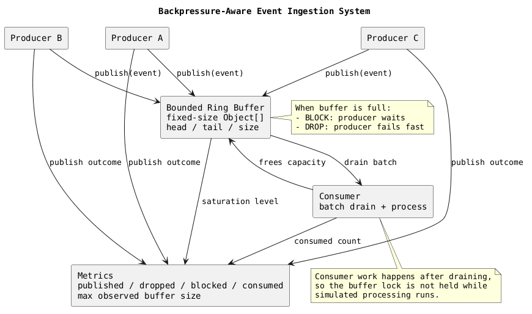

# ringbuffer-backpressure-demo

A backpressure-aware event ingestion system built with plain Java 8 and Maven. The project focuses on one problem only: how to ingest events at high speed with bounded memory, a fixed-size ring buffer, and explicit behavior when producers outrun consumers.



## What This Project Demonstrates

- A fixed-capacity ring buffer implemented on top of a preallocated circular array
- Multiple producers generating events faster than a consumer can drain them
- Two backpressure modes:
  - `BLOCK`: the producer waits until the consumer frees capacity
  - `DROP`: the producer rejects the event immediately when the buffer is full
- A simple benchmark comparison against `ArrayBlockingQueue`

## Why A Ring Buffer Is Fast

A ring buffer is fast because it replaces dynamic node allocation and pointer chasing with predictable array access. Writes advance a tail index, reads advance a head index, and both wrap around using modulo arithmetic. That leads to:

- fewer allocations during steady-state ingestion
- better cache locality than linked-node queue structures
- stable memory usage because capacity never grows
- simpler overflow handling because the buffer has a known hard limit

This project deliberately keeps the coordination model simple with a single monitor so the performance story stays easy to read. The point is not to beat specialized lock-free libraries. The point is to show the mechanics of bounded low-latency ingestion clearly.

## Memory Layout Advantages

The core buffer uses one preallocated `Object[]`:

- events occupy contiguous slots instead of separately allocated queue nodes
- the `head`, `tail`, and `size` fields are enough to describe buffer state
- no resizing happens under load, so heap pressure stays predictable
- consumed slots are nulled out after drain so the GC can reclaim event payloads

That layout matters in low-latency systems because unpredictable allocation growth and indirection often cost more than raw arithmetic on indices.

## Backpressure Strategies

### `BLOCK`

When the ring is full, the producer waits until the consumer drains at least one item.

Use this when:

- every event matters
- producers can tolerate waiting
- protecting downstream correctness matters more than peak ingress rate

Trade-off:

- producer latency rises under saturation
- upstream threads can pile up if the consumer stays slow for too long

### `DROP`

When the ring is full, the producer rejects the event immediately.

Use this when:

- freshness matters more than completeness
- producers must stay responsive under overload
- the system can tolerate loss or retry elsewhere

Trade-off:

- data loss is explicit
- downstream latency stays steadier because the producer does not block

### Future Support

`OFFER_WITH_TIMEOUT` is intentionally not implemented in code to keep the demo narrow. It is a natural next extension when you want a middle ground between fail-fast dropping and indefinite blocking.

## Ring Buffer Vs Queue-Based Systems

`ArrayBlockingQueue` is also bounded and perfectly valid for many systems. The ring-buffer version in this repo is useful when you want to reason directly about:

- how indices move
- how slots are recycled
- when producers are blocked
- what memory is reserved upfront

Queue-based systems are often more convenient out of the box. A hand-rolled ring buffer gives tighter control over layout and semantics, but it also places more correctness responsibility on the implementation.

## Running The Demo

### Prerequisites

- Java 8 or newer
- Maven 3.8+

### Run All Tests

```bash
mvn test
```

### Run The Console Demo

```bash
mvn exec:java
```

The application runs:

- a `DROP` scenario that fills the buffer and rejects excess events
- a `BLOCK` scenario that fills the buffer and forces producer waiting
- a simple benchmark snapshot comparing ring buffer ingestion with `ArrayBlockingQueue`

Example output shape:

```text
=== Backpressure Demo ===
SimulationReport{scenarioName='drop-demo', published=..., dropped=..., blocked=0, consumed=..., maxBufferSize=..., elapsedMillis=...}
SimulationReport{scenarioName='block-demo', published=..., dropped=0, blocked=..., consumed=..., maxBufferSize=..., elapsedMillis=...}

=== Benchmark Snapshot ===
BenchmarkSnapshot{scenarioName='ring-buffer', publishedCount=..., consumedCount=..., droppedCount=0, blockedCount=..., elapsedMillis=...}
BenchmarkSnapshot{scenarioName='array-blocking-queue', publishedCount=..., consumedCount=..., droppedCount=0, blockedCount=..., elapsedMillis=...}
```

## Benchmark Notes

The benchmark is intentionally simple and lives in test code as a reproducible comparison aid. It is useful for:

- validating that both bounded designs actually move work
- observing basic throughput and blocking counters
- showing that the ring-buffer path has a smaller coordination surface

It is not a substitute for JMH or for production-grade latency analysis. Results will vary by machine, JVM, and scheduler behavior.

## Key Classes

- [BoundedRingBuffer.java](src/main/java/com/example/ringbufferbackpressure/buffer/BoundedRingBuffer.java): fixed-size circular buffer with `BLOCK` and `DROP`
- [RingBufferIngestionService.java](src/main/java/com/example/ringbufferbackpressure/core/RingBufferIngestionService.java): metrics-aware wrapper around the ring buffer
- [SimulationRunner.java](src/main/java/com/example/ringbufferbackpressure/demo/SimulationRunner.java): concurrent producer and consumer workload used by the demo
- [IngestionBenchmark.java](src/main/java/com/example/ringbufferbackpressure/benchmark/IngestionBenchmark.java): lightweight benchmark comparison against `ArrayBlockingQueue`

## Trade-Off Summary

Choose a bounded ring buffer when:

- you want explicit memory ceilings
- you care about predictable array-backed storage
- you want to control overload behavior precisely

Choose a queue abstraction when:

- convenience matters more than layout control
- you do not need to explain or tune the internals
- a standard library implementation already satisfies your latency budget
